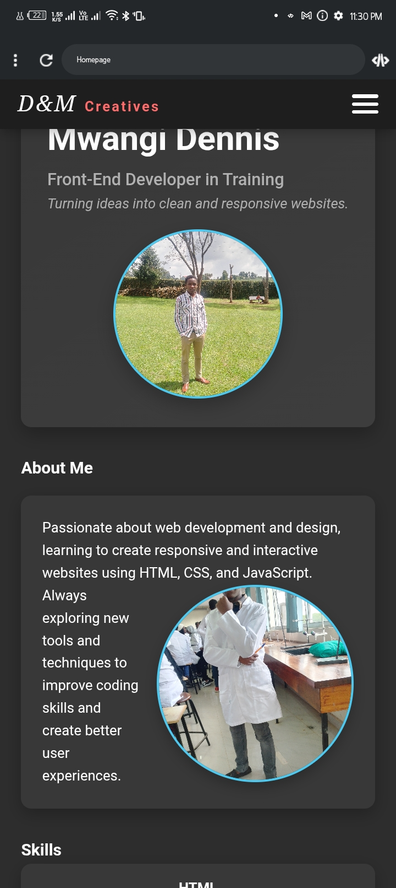

# Portifolio
# My Multi-Page Website

 <!-- Optional: Replace with a screenshot if you have one -->

## Overview
This is a simple multi-page website built with **HTML5** and **CSS3**. It contains five pages, each with its own styling, plus a global CSS file for shared styles.  

All assets are organized in folders for easy management.

## Features
- **Five HTML pages** with unique content.
- **Six CSS files**:
  - `global.css` – shared styles across all pages.
  - `home.css`, `about.css`, `skills.css`, `projects.css`, `contact.css` – page-specific styles.
- **Images folder** containing all images used in the website.
- Clean and organized file structure.

## File Structure
## How to Use
1. Clone or download the repository.
2. Open any HTML file in your browser to view the website.
3. Make sure the `css` and `images` folders stay in the same relative location as the HTML files.

## Technologies Used
- HTML5
- CSS3

## Notes
- Each page has independent styles while inheriting global styles from `global.css`.
- Keep the folder structure intact for proper functioning.
